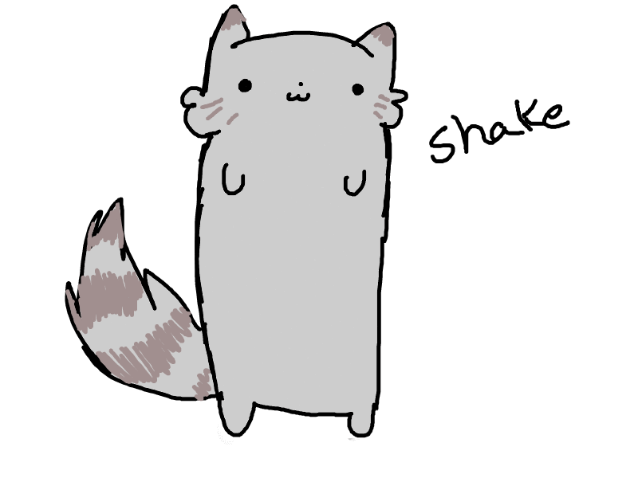

<html>
<head>
Моя домашняя страница
</head>
<body text="000000" bgcolor="#7fc7ff" link="ffffff" vlink="#0000ff" alink="#f0f8ff">

 <h1> Приветствую на моей домашней странице! </h1> 

 <h2> Надеюсь, Вам не будет скучно... </h2> 

 Позвольте представиться: меня зовут <B> <I> Шиповалова Дарья </I>

 Я люблю <B> Фантастику, компьютеры и музыку в стиле Black Metal. </B>

 Терпеть не могу <B> РЭП и хомячков. </B>

 
 Для тех, кто еще не знает, как я выгляжу, - моя фотография: 
 

 
  
 

 Можете попробовать поискать информацию обо мне на <a href="https://yandex.ru/"> Яндексе. </a> 
 

 и напишите мне письмо на <a href="mailto:user@usa.net"> User@usa.net </a>, что у Вас вышло 

 
 Созданные мною сайты: 
 

 <a href=""> Обзор интернет ресурсов по Информационным технологиям </a> 

 <a href=""> Путеводитель по Сургуту </a> 

 
  
 

 
 
 

</body>
</html>
